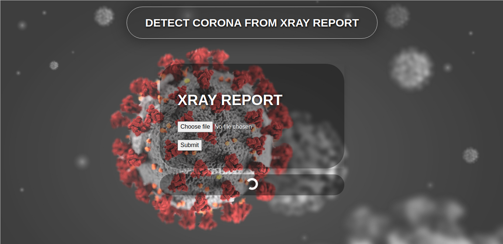

# Predict COVID From Xray Report

<details>
  <summary>:zap: TECH STACK</summary>
  <div style="display:flex;justify-content:space-around">
    
    
    
    
    
  </div>
</details>



## About
It's a ML Model to detect covid from xray reports of the patient.

**INPUT** : **JPEG, PNG, JPG**

**OUTPUT** : **VIRAL, COVID+, COVID-**

#### **PYTORCH IMAGE CLASSIFIER** is used to implement this ML Model.
#### [DATASET](https://www.kaggle.com/tawsifurrahman/covid19-radiography-database?select=COVID-19+Radiography+Database)

## Want To Contribute
### DOCKER SETUP
* download docker, docker-compose
* build and start the docker-compose
```bash
sudo docker-compose build
sudo docker-compose up
```
* now start working on the project

### TRAVIS-CI (CI/CD)
* PR should be accepted by Travis-Ci
* Write test cases if it is needed
* It should be linted [ PEP8 Guidelines ]


